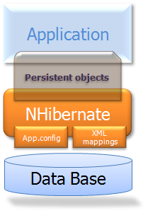
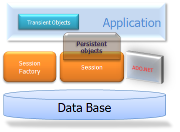
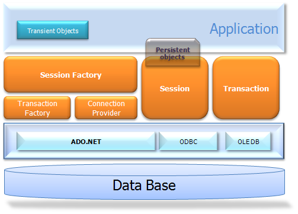

# Architecture

# Overview 

A (very) high-level view of the NHibernate architecture:

This diagram shows NHibernate using the database and configuration data
to provide persistence services (and persistent objects) to the
application.

We would like to show a more detailed view of the runtime architecture.
Unfortunately, NHibernate is flexible and supports several approaches.
We will show the two extremes. The "lite" architecture has the
application provide its own `ADO.NET` connections and manage its own
transactions. This approach uses a minimal subset of NHibernate's APIs:

The "full cream" architecture abstracts the application away from the
underlying `ADO.NET` APIs and lets NHibernate take care of the details.

Here are some definitions of the objects in the diagrams:

  - ISessionFactory (`NHibernate.ISessionFactory`)  
    A threadsafe (immutable) cache of compiled mappings for a single
    database. A factory for `ISession` and a client of
    `IConnectionProvider`. Might hold an optional (second-level) cache
    of data that is reusable between transactions, at a process- or
    cluster-level.

  - ISession (`NHibernate.ISession`)  
    A single-threaded, short-lived object representing a conversation
    between the application and the persistent store. Wraps an `ADO.NET` 
    connection. Factory for `ITransaction`. Holds a mandatory
    (first-level) cache of persistent objects, used when navigating the
    object graph or looking up objects by identifier.

  - Persistent Objects and Collections  
    Short-lived, single threaded objects containing persistent state and
    business function. These might be ordinary POCOs, the only special
    thing about them is that they are currently associated with (exactly
    one) `ISession`. As soon as the `Session` is closed, they will be
    detached and free to use in any application layer (e.g. directly as
    data transfer objects to and from presentation).

  - Transient Objects and Collections  
    Instances of persistent classes that are not currently associated
    with a `ISession`. They may have been instantiated by the
    application and not (yet) persisted or they may have been
    instantiated by a closed `ISession`.

  - ITransaction (`NHibernate.ITransaction`)  
    (Optional) A single-threaded, short-lived object used by the
    application to specify atomic units of work. Abstracts application
    from underlying `ADO.NET` transaction. An `ISession` might span
    several `ITransaction`s in some cases. Transaction scopes may be
    used instead.

  - IConnectionProvider (`NHibernate.Connection.IConnectionProvider`)  
    (Optional) A factory for `ADO.NET` connections and commands. Abstracts
    application from the concrete vendor-specific implementations of
    `DbConnection` and `DbCommand`. Not exposed to application, but can
    be extended/implemented by the developer.

  - IDriver (`NHibernate.Driver.IDriver`)  
    (Optional) An interface encapsulating differences between `ADO.NET` 
    providers, such as parameter naming conventions and supported
    `ADO.NET` features.

  - ITransactionFactory (`NHibernate.Transaction.ITransactionFactory`)  
    (Optional) A factory for `ITransaction` instances. Not exposed to
    the application, but can be extended/implemented by the developer.

Given a "lite" architecture, the application bypasses the
`ITransaction`/`ITransactionFactory` and/or `IConnectionProvider` APIs
to talk to `ADO.NET` directly.

# Instance states 

An instance of a persistent classes may be in one of three different
states, which are defined with respect to a *persistence context*. The
NHibernate `ISession` object is the persistence context:

  - transient  
    The instance is not, and has never been associated with any
    persistence context. It has no persistent identity (primary key
    value).

  - persistent  
    The instance is currently associated with a persistence context. It
    has a persistent identity (primary key value) and, perhaps, a
    corresponding row in the database. For a particular persistence
    context, NHibernate *guarantees* that persistent identity is
    equivalent to CLR identity (in-memory location of the object).

  - detached  
    The instance was once associated with a persistence context, but
    that context was closed, or the instance was serialized to another
    process. It has a persistent identity and, perhaps, a corresponding
    row in the database. For detached instances, NHibernate makes no
    guarantees about the relationship between persistent identity and
    CLR identity.

# Contextual Sessions 

Most applications using NHibernate need some form of "contextual"
sessions, where a given session is in effect throughout the scope of a
given context. However, across applications the definition of what
constitutes a context is typically different; and different contexts
define different scopes to the notion of current.

Starting with version 1.2, NHibernate added the
`ISessionFactory.GetCurrentSession()` method. The processing behind
`ISessionFactory.GetCurrentSession()` is pluggable. An extension
interface (`NHibernate.Context.ICurrentSessionContext`) and a new
configuration parameter (`current_session_context_class`) have been
added to allow pluggability of the scope and context of defining current
sessions.

See the API documentation for the
`NHibernate.Context.ICurrentSessionContext` interface for a detailed
discussion of its contract. It defines a single method,
`CurrentSession()`, by which the implementation is responsible for
tracking the current contextual session. Out-of-the-box, NHibernate
comes with several implementations of this interface:

  - `NHibernate.Context.AsyncLocalSessionContext` - current sessions are
    tracked by current asynchronous flow. You are responsible to bind
    and unbind an `ISession` instance with static methods of class
    `CurrentSessionContext`. Binding operations from inner flows will
    not be propagated to outer or siblings flows. Added in NHibernate
    5.0.

  - `NHibernate.Context.CallSessionContext` - current sessions are
    tracked by `CallContext`. You are responsible to bind and unbind an
    `ISession` instance with static methods of class
    `CurrentSessionContext`.

  - `NHibernate.Context.ThreadStaticSessionContext` - current session is
    stored in a thread-static variable. This context supports multiple
    session factory only since NHibernate v5. You are responsible to
    bind and unbind an `ISession` instance with static methods of class
    `CurrentSessionContext`.

  - `NHibernate.Context.WebSessionContext` - stores the current session
    in `HttpContext`. You are responsible to bind and unbind an
    `ISession` instance with static methods of class
    `CurrentSessionContext`.

  - `NHibernate.Context.WcfOperationSessionContext` - current sessions
    are tracked by WCF `OperationContext`. You need to register the
    `WcfStateExtension` extension in WCF. You are responsible to bind
    and unbind an `ISession` instance with static methods of class
    `CurrentSessionContext`.

  - `NHibernate.Context.ManagedWebSessionContext` - current sessions are
    tracked by `HttpContext`. Removed in NHibernate 4.0 -
    `NHibernate.Context.WebSessionContext` should be used instead. You
    are responsible to bind and unbind an `ISession` instance with
    static methods on this class, it never opens, flushes, or closes an
    `ISession` itself.

The `current_session_context_class` configuration parameter defines
which `NHibernate.Context.ICurrentSessionContext` implementation should
be used. Typically, the value of this parameter would just name the
implementation class to use (including the assembly name); for the
out-of-the-box implementations, however, there are corresponding short
names: `async_local`, `call`, `thread_static`, `web` and
`wcf_operation`, respectively.
