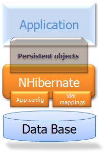
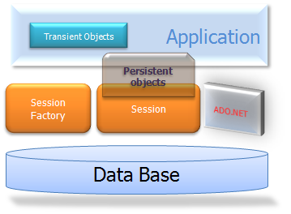
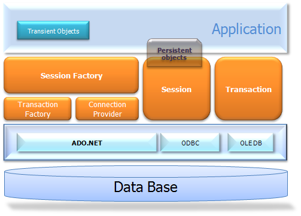

************
Architecture
************

Overview
========

A (very) high-level view of the NHibernate architecture:

|overview|

This diagram shows NHibernate using the database and configuration data to
provide persistence services (and persistent objects) to the application.

We would like to show a more detailed view of the runtime architecture.
Unfortunately, NHibernate is flexible and supports several approaches. We will
show the two extremes. The ”lite” architecture has the application provide its
own ``ADO.NET`` connections and manage its own transactions. This approach uses
a minimal subset of NHibernate”s APIs:

|lite|

The ”full cream” architecture abstracts the application away from the underlying
``ADO.NET`` APIs and lets NHibernate take care of the details.

|fullcream|

Here are some definitions of the objects in the diagrams:

-  ISessionFactory (``NHibernate.ISessionFactory``)
   A threadsafe (immutable) cache of compiled mappings for a single database.
   A factory for ``ISession`` and a client of ``IConnectionProvider``. Might
   hold an optional (second-level) cache of data that is reusable between
   transactions, at a process- or cluster-level.

-  ISession (``NHibernate.ISession``)
   A single-threaded, short-lived object representing a conversation between
   the application and the persistent store. Wraps an ``ADO.NET`` connection.
   Factory for ``ITransaction``. Holds a mandatory (first-level) cache of
   persistent objects, used when navigating the object graph or looking up
   objects by identifier.

-  Persistent Objects and Collections
   Short-lived, single threaded objects containing persistent state and
   business function. These might be ordinary POCOs, the only special thing
   about them is that they are currently associated with (exactly one)
   ``ISession``. As soon as the ``Session`` is closed, they will be detached
   and free to use in any application layer (e.g.”directly as data transfer
   objects to and from presentation).

-  Transient Objects and Collections
   Instances of persistent classes that are not currently associated with a
   ``ISession``. They may have been instantiated by the application and not
   (yet) persisted or they may have been instantiated by a closed ``ISession``.

-  ITransaction (``NHibernate.ITransaction``)
   (Optional) A single-threaded, short-lived object used by the application to
   specify atomic units of work. Abstracts application from underlying
   ``ADO.NET`` transaction. An ``ISession`` might span several
   ``ITransaction``\s in some cases. Transaction scopes may be used instead.

-  IConnectionProvider (``NHibernate.Connection.IConnectionProvider``)
   (Optional) A factory for ``ADO.NET`` connections and commands. Abstracts
   application from the concrete vendor-specific implementations of
   ``DbConnection`` and ``DbCommand``. Not exposed to application, but can be
   extended/implemented by the developer.

-  IDriver (``NHibernate.Driver.IDriver``)
   (Optional) An interface encapsulating differences between ``ADO.NET``
   providers, such as parameter naming conventions and supported ``ADO.NET``
   features.

-  ITransactionFactory (``NHibernate.Transaction.ITransactionFactory``)
   (Optional) A factory for ``ITransaction`` instances. Not exposed to the
   application, but can be extended/implemented by the developer.

Given a ”lite” architecture, the application bypasses the
``ITransaction``/``ITransactionFactory`` and/or ``IConnectionProvider`` APIs to
talk to ``ADO.NET`` directly.

Instance states
===============

An instance of a persistent classes may be in one of three different states,
which are defined with respect to a *persistence context*. The NHibernate
``ISession`` object is the persistence context:

-  transient
   The instance is not, and has never been associated with any persistence
   context. It has no persistent identity (primary key value).

-  persistent
   The instance is currently associated with a persistence context. It has a
   persistent identity (primary key value) and, perhaps, a corresponding row
   in the database. For a particular persistence context, NHibernate
   *guarantees* that persistent identity is equivalent to CLR identity
   (in-memory location of the object).

-  detached
   The instance was once associated with a persistence context, but that
   context was closed, or the instance was serialized to another process. It
   has a persistent identity and, perhaps, a corresponding row in the
   database. For detached instances, NHibernate makes no guarantees about the
   relationship between persistent identity and CLR identity.

.. _architecture-current-session:

Contextual Sessions
===================

Most applications using NHibernate need some form of ”contextual” sessions,
where a given session is in effect throughout the scope of a given context.
However, across applications the definition of what constitutes a context is
typically different; and different contexts define different scopes to the
notion of current.

Starting with version 1.2, NHibernate added the
``ISessionFactory.GetCurrentSession()`` method. The processing behind
``ISessionFactory.GetCurrentSession()`` is pluggable. An extension interface
(``NHibernate.Context.ICurrentSessionContext``) and a new configuration
parameter (``current_session_context_class``) have been added to allow
pluggability of the scope and context of defining current sessions.

See the API documentation for the ``NHibernate.Context.ICurrentSessionContext``
interface for a detailed discussion of its contract. It defines a single method,
``CurrentSession()``, by which the implementation is responsible for tracking
the current contextual session. Out-of-the-box, NHibernate comes with several
implementations of this interface:

-  ``NHibernate.Context.AsyncLocalSessionContext`` - current sessions are
   tracked by current asynchronous flow. You are responsible to bind and unbind
   an ``ISession`` instance with static methods of class
   ``CurrentSessionContext``. Binding operations from inner flows will not be
   propagated to outer or siblings flows. Added in NHibernate 5.0.

-  ``NHibernate.Context.CallSessionContext`` - current sessions are tracked by
   ``CallContext``. You are responsible to bind and unbind an ``ISession``
   instance with static methods of class ``CurrentSessionContext``.

-  ``NHibernate.Context.ThreadStaticSessionContext`` - current session is stored
   in a thread-static variable. This context supports multiple session factory
   only since NHibernate v5. You are responsible to bind and unbind an
   ``ISession`` instance with static methods of class ``CurrentSessionContext``.

-  ``NHibernate.Context.WebSessionContext`` - stores the current session in
   ``HttpContext``. You are responsible to bind and unbind an ``ISession``
   instance with static methods of class ``CurrentSessionContext``.

-  ``NHibernate.Context.WcfOperationSessionContext`` - current sessions are
   tracked by WCF ``OperationContext``. You need to register the
   ``WcfStateExtension`` extension in WCF. You are responsible to bind and
   unbind an ``ISession`` instance with static methods of class
   ``CurrentSessionContext``.

-  ``NHibernate.Context.ManagedWebSessionContext`` - current sessions are
   tracked by ``HttpContext``. Removed in NHibernate 4.0 -
   ``NHibernate.Context.WebSessionContext`` should be used instead. You are
   responsible to bind and unbind an ``ISession`` instance with static methods
   on this class, it never opens, flushes, or closes an ``ISession`` itself.

The ``current_session_context_class`` configuration parameter defines which
``NHibernate.Context.ICurrentSessionContext`` implementation should be used.
Typically, the value of this parameter would just name the implementation class
to use (including the assembly name); for the out-of-the-box implementations,
however, there are corresponding short names: ``async_local``, ``call``,
``thread_static``, ``web`` and ``wcf_operation``, respectively.

