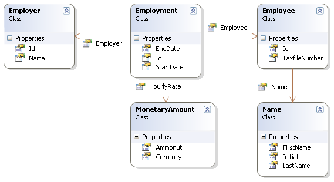
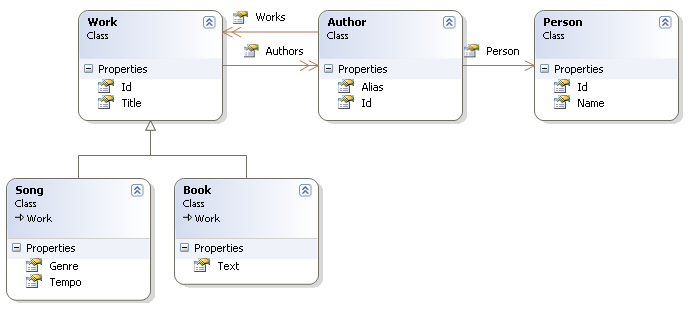
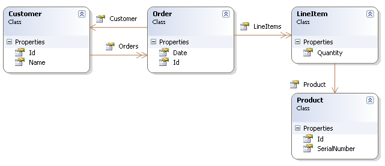

# Example: Various Mappings

This chapter shows off some more complex association mappings.

# Employer/Employee <a name="example-mappings-emp"></a>

The following model of the relationship between `Employer` and
`Employee` uses an actual entity class (`Employment`) to represent the
association. This is done because there might be more than one period of
employment for the same two parties. Components are used to model
monetary values and employee names.



Here's a possible mapping document:

```xml
    <hibernate-mapping xmlns="urn:nhibernate-mapping-2.2" assembly="..." namespace="...">
    
        <class name="Employer" table="employers">
            <id name="Id">
                <generator class="sequence">
                    <param name="sequence">employer_id_seq</param>
                </generator>
            </id>
            <property name="Name"/>
        </class>
    
        <class name="Employment" table="employment_periods">
    
            <id name="Id">
                <generator class="sequence">
                    <param name="sequence">employment_id_seq</param>
                </generator>
            </id>
            <property name="StartDate" column="start_date"/>
            <property name="EndDate" column="end_date"/>
    
            <component name="HourlyRate" class="MonetaryAmount">
                <property name="Amount">
                    <column name="hourly_rate" sql-type="NUMERIC(12, 2)"/>
                </property>
                <property name="Currency" length="12"/>
            </component>
    
            <many-to-one name="Employer" column="employer_id" not-null="true"/>
            <many-to-one name="Employee" column="employee_id" not-null="true"/>
    
        </class>
    
        <class name="Employee" table="employees">
            <id name="Id">
                <generator class="sequence">
                    <param name="sequence">employee_id_seq</param>
                </generator>
            </id>
            <property name="TaxfileNumber"/>
            <component name="Name" class="Name">
                <property name="FirstName"/>
                <property name="Initial"/>
                <property name="LastName"/>
            </component>
        </class>
    
    </hibernate-mapping>
```

And here's the table schema generated by `SchemaExport`.

```sql
    create table employers (
        Id BIGINT not null, 
        Name VARCHAR(255), 
        primary key (Id)
    )
    
    create table employment_periods (
        Id BIGINT not null,
        hourly_rate NUMERIC(12, 2),
        Currency VARCHAR(12), 
        employee_id BIGINT not null, 
        employer_id BIGINT not null, 
        end_date TIMESTAMP, 
        start_date TIMESTAMP, 
        primary key (Id)
    )
    
    create table employees (
        Id BIGINT not null, 
        FirstName VARCHAR(255), 
        Initial CHAR(1), 
        LastName VARCHAR(255), 
        TaxfileNumber VARCHAR(255), 
        primary key (Id)
    )
    
    alter table employment_periods 
        add constraint employment_periodsFK0 foreign key (employer_id) references employers
    alter table employment_periods 
        add constraint employment_periodsFK1 foreign key (employee_id) references employees
    create sequence employee_id_seq
    create sequence employment_id_seq
    create sequence employer_id_seq
```

# Author/Work <a name="example-mappings-authorwork"></a>

Consider the following model of the relationships between `Work`,
`Author` and `Person`. We represent the relationship between `Work` and
`Author` as a many-to-many association. We choose to represent the
relationship between `Author` and `Person` as one-to-one association.
Another possibility would be to have `Author` extend `Person`.



The following mapping document correctly represents these relationships:

```xml
    <hibernate-mapping xmlns="urn:nhibernate-mapping-2.2" assembly="..." namespace="...">
    
        <class name="Work" table="works" discriminator-value="W">
    
            <id name="Id" column="id" generator="native" />
    
            <discriminator column="type" type="character"/>
    
            <property name="Title"/>
            <set name="Authors" table="author_work" lazy="true">
                <key>
                    <column name="work_id" not-null="true"/>
                </key>
                <many-to-many class="Author">
                    <column name="author_id" not-null="true"/>
                </many-to-many>
            </set>
    
            <subclass name="Book" discriminator-value="B">
                <property name="Text" column="text" />
            </subclass>
    
            <subclass name="Song" discriminator-value="S">
                <property name="Tempo" column="tempo" />
                <property name="Genre" column="genre" />
            </subclass>
    
        </class>
    
        <class name="Author" table="authors">
    
            <id name="Id" column="id">
                <!-- The Author must have the same identifier as the Person -->
                <generator class="assigned"/> 
            </id>
    
            <property name="Alias" column="alias" />
            <one-to-one name="Person" constrained="true"/>
    
            <set name="Works" table="author_work" inverse="true" lazy="true">
                <key column="author_id"/>
                <many-to-many class="Work" column="work_id"/>
            </set>
    
        </class>
    
        <class name="Person" table="persons">
            <id name="Id" column="id">
                <generator class="native"/>
            </id>
            <property name="Name" column="name" />
        </class>
    
    </hibernate-mapping>
```

There are four tables in this mapping. `works`, `authors` and `persons`
hold work, author and person data respectively. `author_work` is an
association table linking authors to works. Here is the table schema, as
generated by `SchemaExport`.

```sql
    create table works (
        id BIGINT not null generated by default as identity, 
        tempo FLOAT, 
        genre VARCHAR(255), 
        text INTEGER, 
        title VARCHAR(255), 
        type CHAR(1) not null, 
        primary key (id)
    )
    
    create table author_work (
        author_id BIGINT not null, 
        work_id BIGINT not null, 
        primary key (work_id, author_id)
    )
    
    create table authors (
        id BIGINT not null generated by default as identity, 
        alias VARCHAR(255), 
        primary key (id)
    )
    
    create table persons (
        id BIGINT not null generated by default as identity, 
        name VARCHAR(255), 
        primary key (id)
    )
    
    alter table authors 
        add constraint authorsFK0 foreign key (id) references persons
    alter table author_work 
        add constraint author_workFK0 foreign key (author_id) references authors
    alter table author_work
        add constraint author_workFK1 foreign key (work_id) references works
```

# Customer/Order/Product <a name="example-mappings-customerorderproduct"></a>

Now consider a model of the relationships between `Customer`, `Order`
and `LineItem` and `Product`. There is a one-to-many association between
`Customer` and `Order`, but how should we represent `Order` / `LineItem`
/ `Product`? I've chosen to map `LineItem` as an association class
representing the many-to-many association between `Order` and `Product`.
In NHibernate, this is called a composite element.



The mapping document:

```xml
    <hibernate-mapping xmlns="urn:nhibernate-mapping-2.2" assembly="..." namespace="...">
    
        <class name="Customer" table="customers">
            <id name="Id" column="id" generator="native" />
            <property name="Name" column="name"/>
            <set name="Orders" inverse="true" lazy="true">
                <key column="customer_id"/>
                <one-to-many class="Order"/>
            </set>
        </class>
    
        <class name="Order" table="orders">
            <id name="Id" column="id" generator="native" />
            <property name="Date" column="date"/>
            <many-to-one name="Customer" column="customer_id"/>
            <list name="LineItems" table="line_items" lazy="true">
                <key column="order_id"/>
                <index column="line_number"/>
                <composite-element class="LineItem">
                    <property name="Quantity" column="quantity"/>
                    <many-to-one name="Product" column="product_id"/>
                </composite-element>
            </list>
        </class>
    
        <class name="Product" table="products">
            <id name="Id" column="id">
                <generator class="native"/>
            </id>
            <property name="SerialNumber" column="serial_number" />
        </class>
    
    </hibernate-mapping>
```

`customers`, `orders`, `line_items` and `products` hold customer, order,
order line item and product data respectively. `line_items` also acts as
an association table linking orders with products.

```sql
    create table customers (
        id BIGINT not null generated by default as identity, 
        name VARCHAR(255), 
        primary key (id)
    )
    
    create table orders (
        id BIGINT not null generated by default as identity, 
        customer_id BIGINT, 
        date TIMESTAMP, 
        primary key (id)
    )
    
    create table line_items (
        line_number INTEGER not null, 
        order_id BIGINT not null, 
        product_id BIGINT, 
        quantity INTEGER, 
        primary key (order_id, line_number)
    )
    
    create table products (
        id BIGINT not null generated by default as identity, 
        serial_number VARCHAR(255), 
        primary key (id)
    )
    
    alter table orders 
        add constraint ordersFK0 foreign key (customer_id) references customers
    alter table line_items
        add constraint line_itemsFK0 foreign key (product_id) references products
    alter table line_items
        add constraint line_itemsFK1 foreign key (order_id) references orders
```
